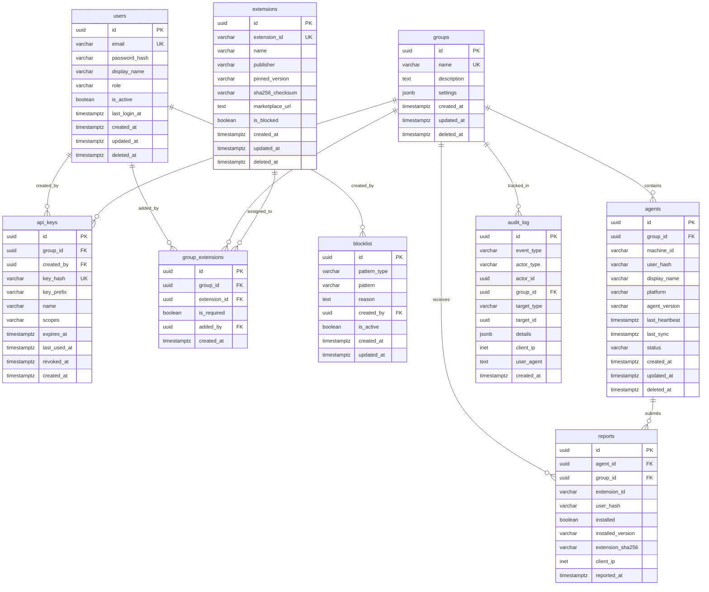

# Database Schema Diagram

```mermaid
erDiagram
    users ||--o{ api_keys : "created_by"
    users ||--o{ group_extensions : "added_by"
    users ||--o{ blocklist : "created_by"

    groups ||--o{ agents : "contains"
    groups ||--o{ api_keys : "has"
    groups ||--o{ group_extensions : "has"
    groups ||--o{ reports : "receives"
    groups ||--o{ audit_log : "tracked_in"

    extensions ||--o{ group_extensions : "assigned_to"

    agents ||--o{ reports : "submits"

    users {
        uuid id PK
        varchar email UK
        varchar password_hash
        varchar display_name
        varchar role
        boolean is_active
        timestamptz last_login_at
        timestamptz created_at
        timestamptz updated_at
        timestamptz deleted_at
    }

    groups {
        uuid id PK
        varchar name UK
        text description
        jsonb settings
        timestamptz created_at
        timestamptz updated_at
        timestamptz deleted_at
    }

    extensions {
        uuid id PK
        varchar extension_id UK
        varchar name
        varchar publisher
        varchar pinned_version
        varchar sha256_checksum
        text marketplace_url
        boolean is_blocked
        timestamptz created_at
        timestamptz updated_at
        timestamptz deleted_at
    }

    agents {
        uuid id PK
        uuid group_id FK
        varchar machine_id
        varchar user_hash
        varchar display_name
        varchar platform
        varchar agent_version
        timestamptz last_heartbeat
        timestamptz last_sync
        varchar status
        timestamptz created_at
        timestamptz updated_at
        timestamptz deleted_at
    }

    api_keys {
        uuid id PK
        uuid group_id FK
        uuid created_by FK
        varchar key_hash UK
        varchar key_prefix
        varchar name
        varchar scopes
        timestamptz expires_at
        timestamptz last_used_at
        timestamptz revoked_at
        timestamptz created_at
    }

    group_extensions {
        uuid id PK
        uuid group_id FK
        uuid extension_id FK
        boolean is_required
        uuid added_by FK
        timestamptz created_at
    }

    reports {
        uuid id PK
        uuid agent_id FK
        uuid group_id FK
        varchar extension_id
        varchar user_hash
        boolean installed
        varchar installed_version
        varchar extension_sha256
        inet client_ip
        timestamptz reported_at
    }

    blocklist {
        uuid id PK
        varchar pattern_type
        varchar pattern
        text reason
        uuid created_by FK
        boolean is_active
        timestamptz created_at
        timestamptz updated_at
    }

    audit_log {
        uuid id PK
        varchar event_type
        varchar actor_type
        uuid actor_id
        uuid group_id FK
        varchar target_type
        uuid target_id
        jsonb details
        inet client_ip
        text user_agent
        timestamptz created_at
    }
```
